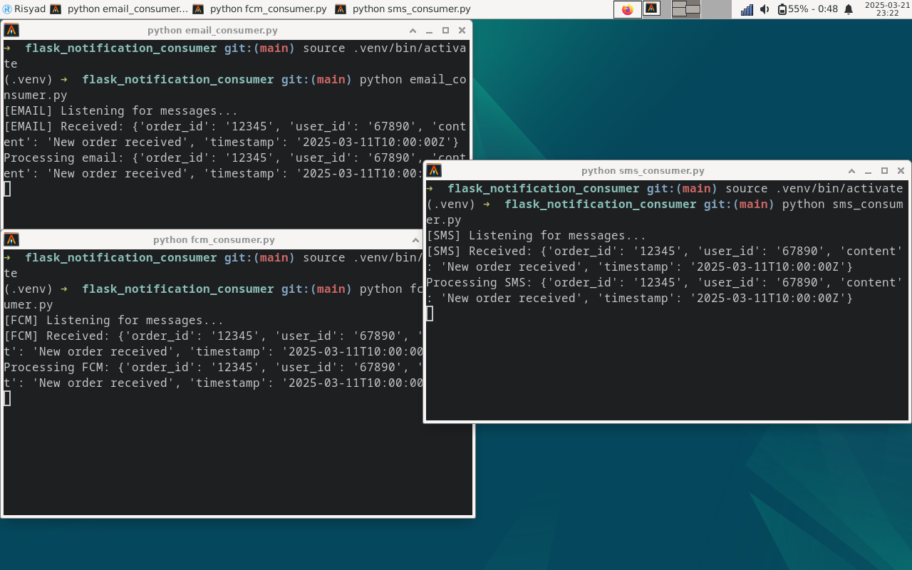

# Notification Service dengan RabbitMQ dan Flask 🚀

## Screenshot


### Buat sebuah virtual environment
```
python3 -m venv .venv
```
### Aktifkan virtual environment
```
source .venv/bin/activate
```

### Install requirements
```
pip install -r requirements.txt
```

### Jalankan email_consumer
```
python email_consumer.py
```

### Jalankan fcm_consumer
```
python fcm_consumer.py
```

### Jalankan sms_consumer
```
python sms_consumer.py
```
